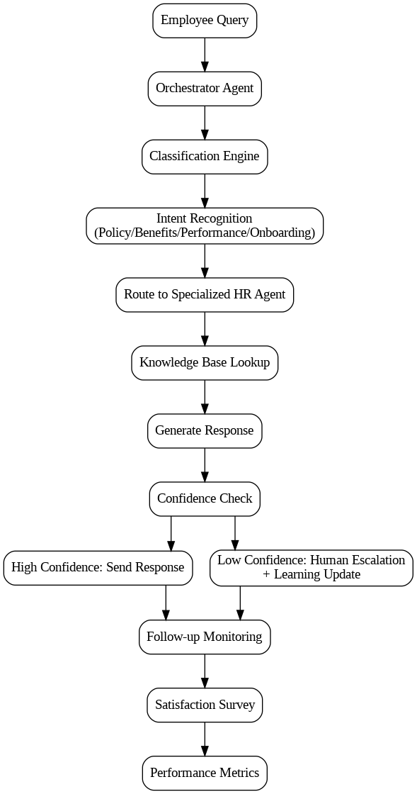
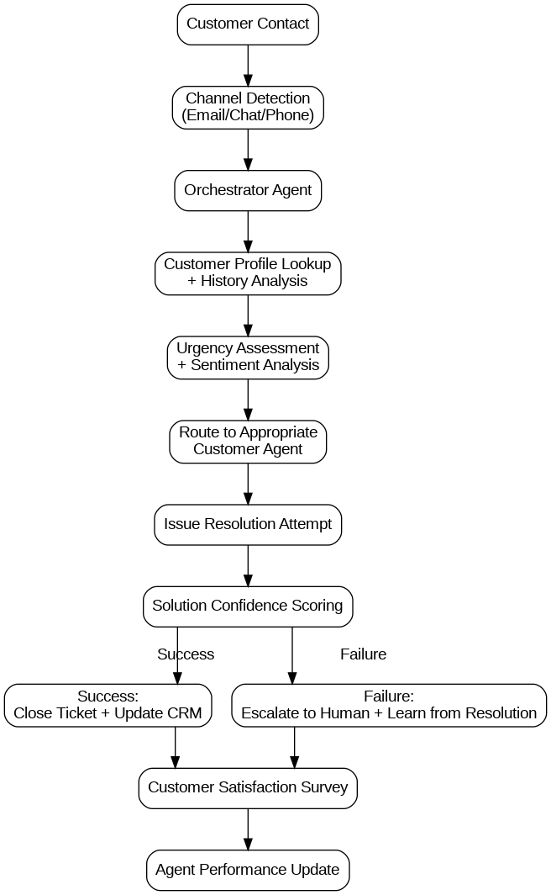
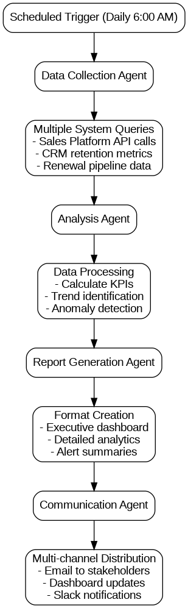
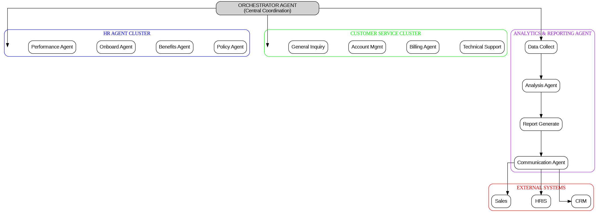

# **Agentic Workforce Framework Design**
**Assignment 2 - Internship Submission**

**Submitted by:** Ujjwal Sharma  
**Email:** ujjwalsh2004@gmail.com  
**Date:** June 13, 
## **Executive Summary**

This framework presents an intelligent multi-agent system designed to autonomously manage HR operations, customer support, and business intelligence reporting. The system leverages specialized AI agents that work collaboratively to handle queries, generate insights, and maintain operational efficiency while reducing human workload and improving response times.

## **Agent Ecosystem Architecture**

### **Core Agent Roles**

**1. Orchestrator Agent (Master Controller)**
- **Primary Function**: Central coordination and routing hub
- **Capabilities**: Query classification, agent assignment, workflow management, escalation handling
- **Decision Authority**: High-level routing decisions, resource allocation, priority management
- **Learning**: Optimizes routing patterns based on resolution success rates

**2. HR Agent Cluster**
- **HR Policy Agent**: Handles policy inquiries, compliance questions, procedure guidance
- **Benefits Agent**: Manages insurance, retirement, leave policies, enrollment assistance
- **Onboarding Agent**: New employee processes, documentation, training coordination
- **Performance Agent**: Review processes, goal setting, career development guidance
- **Capabilities**: Natural language understanding, policy database access, workflow automation
- **Escalation**: Complex disputes → Human HR Manager

**3. Customer Service Agent Cluster**
- **Technical Support Agent**: Product troubleshooting, feature guidance, integration help
- **Billing Agent**: Payment issues, subscription management, invoicing questions
- **Account Management Agent**: Relationship management, upselling opportunities, renewal discussions
- **General Inquiry Agent**: Basic questions, information requests, initial triage
- **Capabilities**: CRM integration, product knowledge base, sentiment analysis
- **Escalation**: Dissatisfied customers → Human representative

**4. Analytics & Reporting Agent**
- **Data Collection Agent**: Gathers metrics from CRM, sales systems, support platforms
- **Analysis Agent**: Processes data, identifies trends, generates insights
- **Report Generation Agent**: Creates formatted reports, visualizations, summaries
- **Communication Agent**: Distributes reports via email, dashboards, notifications
- **Capabilities**: Real-time data processing, predictive modeling, automated scheduling

## **Workflow Management System**

### **HR Query Workflow**

The workflow begins when an employee submits a query through any channel (email, portal, chat). The orchestrator agent immediately classifies the query using intent recognition to determine whether it relates to policy, benefits, performance, or onboarding. Based on this classification, the query is routed to the appropriate specialized HR agent, which performs a knowledge base lookup and generates a response. The system includes a confidence check mechanism - high confidence responses are sent directly to the employee, while low confidence scenarios trigger human escalation and learning updates. The workflow concludes with follow-up monitoring, satisfaction surveys, and performance metrics collection.

### **Customer Query Workflow**

The system begins with channel detection across email, chat, and phone interfaces. The orchestrator agent performs customer profile lookup and history analysis, followed by urgency assessment and sentiment analysis to prioritize the request appropriately. The query is then routed to the most suitable customer service agent based on the issue type and customer context. After attempting resolution, the system performs solution confidence scoring - successful resolutions close the ticket and update the CRM, while failures trigger escalation to human representatives with learning feedback loops. The process ends with customer satisfaction surveys and agent performance updates.

### **Daily Reporting Workflow**

The reporting system activates daily at 6:00 AM with scheduled triggers. The data collection agent simultaneously queries multiple systems including sales platforms, CRM systems for retention metrics, and renewal pipeline databases. The analysis agent processes this collected data by calculating KPIs, identifying trends, and detecting anomalies. The report generation agent then creates multiple output formats including executive dashboards, detailed analytics reports, and alert summaries. Finally, the communication agent distributes these reports through multiple channels including email to stakeholders, dashboard updates, and Slack notifications.

## **Query Management Systems**

### **HR Query Categories & Handling**

**Employee Onboarding**
- Automated checklist generation
- Document collection and verification
- System access provisioning coordination
- Training schedule optimization
- Progress tracking and reminders

**Benefits & Compensation**
- Real-time plan comparisons
- Enrollment assistance
- Claims status tracking
- Cost calculations
- Open enrollment management

**Policy & Compliance**
- Policy interpretation and guidance
- Compliance requirement updates
- Training requirement tracking
- Incident reporting workflows
- Audit preparation assistance

**Performance Management**
- Goal setting templates
- Review scheduling
- Feedback collection
- Career development planning
- Skills gap analysis

### **Customer Query Categories & Handling**

**Technical Support**
- Diagnostic questionnaires
- Step-by-step troubleshooting
- Video tutorial recommendations
- Integration testing assistance
- Bug report escalation

**Billing & Accounts**
- Invoice explanations
- Payment method updates
- Usage tracking
- Billing dispute resolution
- Subscription modifications

**Product Information**
- Feature demonstrations
- Compatibility checking
- Implementation planning
- Best practice recommendations
- Upgrade pathway guidance

## **Reporting & Analytics Engine**

### **Sales Reports**
**Daily Metrics:**
- Revenue by product line
- Deal closure rates
- Pipeline velocity
- Lead conversion statistics
- Sales rep performance

**Automated Insights:**
- Trend identification (weekly/monthly comparisons)
- Forecast accuracy analysis
- Opportunity risk assessment
- Territory performance rankings

### **Retention Analysis**
**Key Metrics:**
- Customer churn rate by segment
- Usage pattern analysis
- Support ticket correlation with churn
- Net Promoter Score trends
- Customer lifetime value calculations

**Predictive Components:**
- Churn probability scoring
- Early warning system triggers
- Intervention recommendation engine
- Success probability forecasting

### **Renewal Tracking**
**Monitoring Elements:**
- Contract expiration calendars
- Renewal probability scoring
- Engagement level assessment
- Competitive threat analysis
- Upsell opportunity identification

**Automated Actions:**
- Renewal reminder sequences
- Risk-based alert generation
- Account manager notifications
- Proposal generation triggers

## **AI & Automation Features**

### **Natural Language Processing**
- **Intent Recognition**: Advanced NLP for query classification
- **Sentiment Analysis**: Real-time emotional state detection
- **Language Translation**: Multi-language support for global operations
- **Context Understanding**: Conversation history awareness

### **Machine Learning Models**
- **Predictive Analytics**: Churn prediction, renewal probability, sales forecasting
- **Recommendation Engine**: Next best actions, relevant resources, solution suggestions
- **Pattern Recognition**: Anomaly detection in metrics, trend identification
- **Performance Optimization**: Agent routing optimization, response time improvement

### **Automation Components**
- **Workflow Triggers**: Event-based automation for common scenarios
- **Smart Escalation**: Automatic human handoff based on complexity thresholds
- **Self-Learning**: Continuous improvement from interaction outcomes
- **Integration APIs**: Seamless connectivity with existing business systems

## **Visual Architecture Diagram**

The architecture displays a hierarchical structure with the Orchestrator Agent at the top serving as the central coordination hub. Below it, three main agent clusters operate in parallel: the HR Agent Cluster (containing Policy, Benefits, Onboarding, and Performance agents), the Customer Service Cluster (with Technical Support, Billing, Account Management, and General Inquiry agents), and the Analytics & Reporting Agent (encompassing Data Collection, Analysis, Report Generation, and Communication agents). All agents connect to external systems including CRM, HRIS, and Sales platforms, ensuring seamless integration with existing business infrastructure.

## **Implementation Roadmap**

### **Phase 1: Foundation (Months 1-2)**
- Deploy Orchestrator Agent
- Basic HR and Customer Service agents
- Simple query routing
- Initial knowledge bases

### **Phase 2: Intelligence (Months 3-4)**
- Advanced NLP capabilities
- Machine learning model integration
- Automated escalation logic
- Performance monitoring

### **Phase 3: Analytics (Months 5-6)**
- Reporting agent deployment
- Dashboard creation
- Predictive analytics
- Automated insights generation

### **Phase 4: Optimization (Months 7-8)**
- Self-learning capabilities
- Advanced automation
- Integration expansion
- Performance optimization

## **Cost Analysis & Implementation Budget**

### **Infrastructure Costs (Monthly)**

| Component | Service | Configuration | Monthly Cost |
|-----------|---------|---------------|--------------|
| Database | Supabase Pro | 8GB storage, 100K MAU | $25 |
| Compute | Supabase Medium | 4GB RAM, 2-core ARM | $60 |
| Vector DB | Pinecone Standard | Serverless, 15GB included | $25 |
| Message Queue | Aiven Kafka Startup | 3 VM cluster | $200 |
| Monitoring | Grafana Cloud | 8 users, 7K metrics | $120 |
| **Total Monthly** | | | **$430** |

### **Annual Cost Projection**

| Year | Infrastructure | Development | Total |
|------|---------------|-------------|-------|
| Year 1 | $5,160 | $120,000 | $125,160 |
| Year 2 | $8,640 | $60,000 | $68,640 |
| Year 3+ | $10,320 | $40,000 | $50,320 |

*Development costs include initial setup, training, and maintenance*

### **ROI Analysis**

**Cost Savings:**
- HR query handling: 60% reduction in manual processing = $180,000/year
- Customer support efficiency: 40% improvement = $150,000/year
- Report generation automation: 90% time savings = $80,000/year

**Total Annual Savings: $410,000**
**Net ROI: 227% in Year 1**

## **Risk Assessment & Mitigation**

### **Technical Risks**

**1. System Integration Failures**
- **Risk Level**: Medium
- **Impact**: Service disruptions, data inconsistencies
- **Mitigation**: Comprehensive API testing, fallback mechanisms, staged rollouts
- **Contingency**: Manual override capabilities, 24/7 monitoring

**2. AI Model Performance Degradation**
- **Risk Level**: Medium
- **Impact**: Reduced accuracy, increased escalations
- **Mitigation**: Continuous model monitoring, A/B testing, regular retraining
- **Contingency**: Human-in-the-loop fallbacks, confidence thresholds

**3. Data Security Breaches**
- **Risk Level**: High
- **Impact**: Compliance violations, reputation damage
- **Mitigation**: End-to-end encryption, access controls, regular audits
- **Contingency**: Incident response plan, data backup protocols

### **Operational Risks**

**1. User Adoption Resistance**
- **Risk Level**: Medium
- **Impact**: Low utilization, reduced ROI
- **Mitigation**: Comprehensive training, gradual rollout, user feedback loops
- **Contingency**: Change management support, incentive programs

**2. Scalability Limitations**
- **Risk Level**: Low
- **Impact**: Performance degradation during peak loads
- **Mitigation**: Auto-scaling infrastructure, load testing, capacity planning
- **Contingency**: Manual scaling procedures, resource monitoring

### **Business Risks**

**1. Budget Overruns**
- **Risk Level**: Medium
- **Impact**: Project delays, reduced scope
- **Mitigation**: Detailed cost tracking, phased implementation, vendor negotiations
- **Contingency**: Alternative service providers, scope adjustments

**2. Regulatory Compliance Changes**
- **Risk Level**: Low
- **Impact**: System modifications required
- **Mitigation**: Regular compliance reviews, flexible architecture design
- **Contingency**: Rapid response protocols, legal consultation

## **Success Metrics & KPIs**

### **Operational Efficiency**
- Query resolution time: Target 80% under 5 minutes
- First-contact resolution rate: Target 75%
- Escalation rate: Target under 15%
- Agent availability: Target 99.5% uptime

### **Business Impact**
- Customer satisfaction score improvement: Target +20%
- HR query volume reduction: Target 60%
- Report generation time: Target 90% reduction
- Cost per interaction: Target 50% reduction

### **Learning & Improvement**
- Model accuracy improvement: Target 5% monthly
- Knowledge base growth rate: Target 100 new articles/month
- Workflow optimization cycles: Target weekly improvements
- Integration success rate: Target 95% API reliability

## **Conclusion**

This comprehensive agentic workforce framework represents a transformative approach to enterprise operations, combining cutting-edge AI technologies with proven business processes. The system's multi-agent architecture ensures scalable, intelligent automation while maintaining human oversight for complex scenarios.

**Key Value Propositions:**
- **Operational Excellence**: 60% reduction in manual HR processing and 40% improvement in customer support efficiency
- **Cost Effectiveness**: 227% ROI in the first year with total annual savings of $410,000
- **Scalable Architecture**: Cloud-native design supporting growth from startup to enterprise scale
- **Risk Management**: Comprehensive mitigation strategies addressing technical, operational, and business risks

The framework's phased implementation approach minimizes disruption while maximizing value delivery. With proper risk management and continuous optimization, this agentic workforce system will provide sustainable competitive advantages through enhanced operational efficiency, improved customer experience, and data-driven decision making.

The investment in this framework positions the organization at the forefront of AI-driven business automation, creating a foundation for future innovation and growth while delivering immediate operational benefits.

